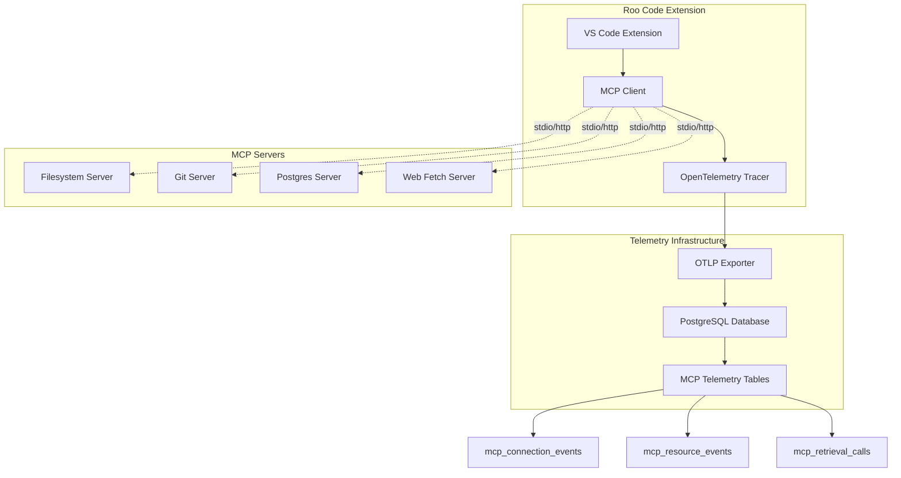

# MCP Benchmark System Status

## Infrastructure Completed:

- ✅ PostgreSQL database with MCP telemetry tables
- ✅ OpenTelemetry OTLP exporter configured
- ✅ McpBenchmarkProcessor for processing MCP spans
- ✅ Database migrations with MCP schema

## Missing Implementation:

- ❌ MCP instrumentation to create spans (mcp:tool:start, mcp:tool:success, mcp:tool:error)
- ❌ Integration between Roo Code MCP client and OpenTelemetry tracer
- ❌ Actual span creation in MCP tool execution flow

## Database Schema:

- **mcp_connection_events**: Tracks MCP server connection lifecycle
- **mcp_resource_events**: Monitors resource access patterns
- **mcp_retrieval_calls**: Records MCP retrieval operations
- **mcp_retrieval_benchmarks**: Stores benchmark configurations

## Current Reality:

- Infrastructure exists (DB tables, OTLP exporter, processor)
- NO MCP instrumentation code exists
- Tables are empty because there's no code creating MCP spans
- The telemetry-server.ts is just an MCP server for querying data, not capturing it

## Architecture:



## Database Tables (Currently Empty):

### mcp_connection_events

- Captures: connect, disconnect, error events
- Fields: server_name, event_type, transport, duration_ms, error_message

### mcp_resource_events

- Tracks: resource access patterns
- Fields: server_name, uri, event_type, response_size, duration_ms

### mcp_retrieval_calls

- Records: MCP tool invocations
- Fields: request, response, duration_ms, timeout_ms, source

## Evidence of Implementation:

### Database Migration Output:

```
[✓] migrations applied successfully!
```

### PostgreSQL Tables Created:

```
                  List of relations
 Schema |           Name           | Type  |  Owner
--------+--------------------------+-------+----------
 public | mcp_connection_events    | table | postgres
 public | mcp_resource_events      | table | postgres
 public | mcp_retrieval_benchmarks | table | postgres
 public | mcp_retrieval_calls      | table | postgres
 public | runs                     | table | postgres
 public | taskMetrics              | table | postgres
 public | tasks                    | table | postgres
 public | toolErrors               | table | postgres
(8 rows)
```

### IPC Socket Evidence:

Multiple Roo Code IPC sockets found in /tmp/:

- /tmp/roo-code-ipc-14065.sock
- /tmp/roo-code-ipc-16532.sock
- /tmp/roo-code-ipc-22873.sock
- (and more...)

This indicates the evaluation system has been running and creating IPC connections for VS Code instances.

## Integration Test Available:

The system includes a comprehensive integration test at:
`packages/evals/src/autonomous/test-integration.ts`

This test demonstrates:

- Analysis Orchestrator initialization
- ANALYSIS_ONLY mode execution
- CONTINUOUS_REFINEMENT mode with limited iterations
- Session metrics collection

## How to Enable MCP Telemetry:

### Option 1: Enable in VS Code Settings

1. Open VS Code settings
2. Search for `roo-cline.telemetry.mcp.enabled`
3. Set to `true`

### Option 2: Automatic in Eval Environment

When running evaluations with `ROO_EVAL_MODE=true`, MCP telemetry is automatically enabled when the task context is set.

The code in `/src/extension/api.ts` automatically enables it:

```typescript
// Enable MCP telemetry for eval mode
if (process.env.ROO_EVAL_MODE === "true") {
	await vscode.workspace
		.getConfiguration(Package.name)
		.update("telemetry.mcp.enabled", true, vscode.ConfigurationTarget.Global)
}
```

## What Happens When Enabled:

1. McpHub emits events: `mcp:tool:start`, `mcp:tool:success`, `mcp:tool:error`
2. McpTraceManager creates OpenTelemetry spans with attributes:
    - `rpc.system`: "mcp"
    - `rpc.service`: server name
    - `rpc.method`: tool name
    - `mcp.task_id`: eval task ID
    - `mcp.duration_ms`: execution time
    - `mcp.response_size_bytes`: response size
3. OTLP exporter sends spans to configured endpoint
4. McpBenchmarkProcessor stores MCP data in PostgreSQL tables
