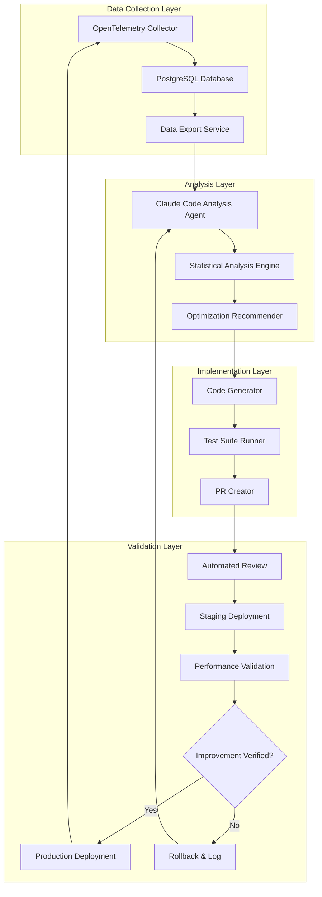
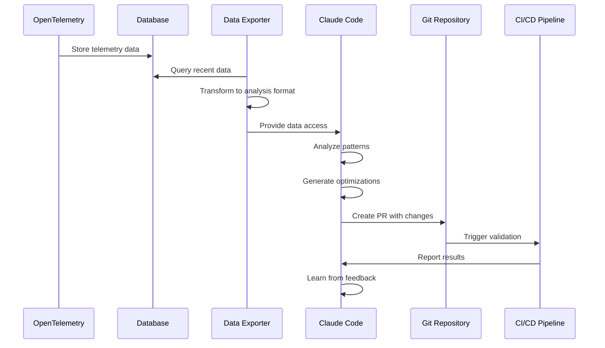
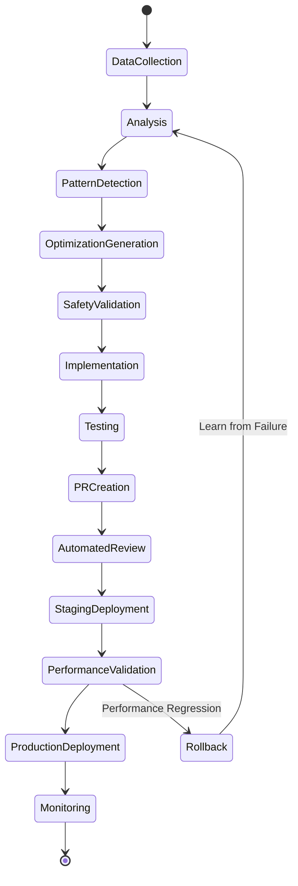

# Autonomous MCP Evaluation Analysis System - Implementation Plan

## Overview

This document outlines the implementation plan for an autonomous system that leverages Claude Code's agentic capabilities to continuously analyze MCP evaluation telemetry data and implement improvements without human intervention.

## Goals

1. **Automated Analysis**: Continuously analyze OpenTelemetry data from MCP evaluations
2. **Pattern Recognition**: Identify performance patterns and optimization opportunities
3. **Autonomous Improvement**: Implement code and configuration improvements based on data
4. **Safety & Validation**: Ensure all changes are safe and validated before deployment

## Architecture

### System Components



### Data Flow



## Technical Implementation

### 1. Data Export Service

```typescript
// packages/evals/src/autonomous/DataExportService.ts
interface TelemetryExport {
	timeRange: { start: Date; end: Date }
	metrics: {
		mcpCalls: McpCallMetrics[]
		taskPerformance: TaskPerformanceMetrics[]
		tokenUsage: TokenUsageMetrics[]
	}
	aggregations: {
		byServer: ServerPerformanceStats[]
		byTaskType: TaskTypeStats[]
		byTimeWindow: TimeWindowStats[]
	}
}
```

### 2. Claude Code Integration

#### Analysis Script

```bash
#!/bin/bash
# packages/evals/scripts/autonomous-analysis.sh

# Export recent telemetry data
npm run export:telemetry -- --days 7 --format json > telemetry-export.json

# Run Claude Code analysis
claude -p "Analyze MCP telemetry and implement optimizations" \
  --system-prompt "$(cat packages/evals/specs/Agentics/CLAUDE.md)" \
  --mcp-config packages/evals/specs/Agentics/mcp-config.json \
  --output-format stream-json \
  --max-turns 20 \
  --allowedTools "read_file,write_to_file,apply_diff,search_files" \
  > analysis-results.json

# Process results
npm run process:analysis-results -- analysis-results.json
```

#### MCP Configuration

```json
{
	"mcpServers": {
		"telemetry-db": {
			"command": "node",
			"args": ["packages/evals/src/autonomous/mcp-telemetry-server.js"],
			"env": {
				"DATABASE_URL": "${DATABASE_URL}"
			}
		},
		"code-analysis": {
			"command": "npx",
			"args": ["-y", "@modelcontextprotocol/server-filesystem", "packages/evals"]
		}
	}
}
```

### 3. CLAUDE.md Configuration

```markdown
# Claude Code Autonomous Analysis Agent

You are an autonomous agent responsible for analyzing MCP evaluation telemetry and implementing optimizations.

## Objectives

1. Analyze telemetry data to identify performance bottlenecks
2. Recommend and implement optimizations
3. Ensure all changes are safe and tested

## Constraints

### Files You Can Modify

- `packages/evals/src/benchmark/strategies/*.ts` - MCP retrieval strategies
- `packages/evals/config/mcp-servers.json` - MCP server configurations
- `packages/evals/src/benchmark/scoring/*.ts` - Scoring algorithms

### Files You Cannot Modify

- Database schemas
- Core evaluation framework
- Production MCP server implementations

## Analysis Guidelines

1. **Statistical Significance**: Only act on patterns with p-value < 0.05
2. **Minimum Sample Size**: Require at least 100 data points
3. **Performance Threshold**: Only optimize if improvement > 10%
4. **Safety First**: Never remove existing functionality

## Implementation Process

1. Analyze data using statistical methods
2. Generate hypothesis for improvement
3. Implement minimal change
4. Add comprehensive tests
5. Document rationale in PR description
```

### 4. Safety Mechanisms

#### Pre-Implementation Checks

```typescript
// packages/evals/src/autonomous/SafetyValidator.ts
class SafetyValidator {
	async validateChange(change: ProposedChange): Promise<ValidationResult> {
		const checks = [
			this.checkFilePermissions(change),
			this.checkCodeComplexity(change),
			this.checkTestCoverage(change),
			this.checkBackwardCompatibility(change),
			this.checkPerformanceRegression(change),
		]

		const results = await Promise.all(checks)
		return this.aggregateResults(results)
	}
}
```

#### Rollback Mechanism

```typescript
// packages/evals/src/autonomous/RollbackManager.ts
class RollbackManager {
	async monitorDeployment(deploymentId: string): Promise<void> {
		const metrics = await this.collectMetrics(deploymentId)

		if (this.detectRegression(metrics)) {
			await this.initiateRollback(deploymentId)
			await this.notifyStakeholders(deploymentId, metrics)
		}
	}
}
```

### 5. Autonomous Workflow



## Implementation Phases

### Phase 1: Data Infrastructure (Week 1-2)

- [ ] Implement data export service
- [ ] Create MCP telemetry server
- [ ] Set up data transformation pipeline
- [ ] Create analysis-ready data formats

### Phase 2: Analysis Framework (Week 3-4)

- [ ] Implement statistical analysis tools
- [ ] Create pattern detection algorithms
- [ ] Build optimization recommendation engine
- [ ] Develop hypothesis testing framework

### Phase 3: Claude Integration (Week 5-6)

- [ ] Create CLAUDE.md configuration
- [ ] Implement MCP server interfaces
- [ ] Build analysis automation scripts
- [ ] Set up session management

### Phase 4: Safety & Validation (Week 7-8)

- [ ] Implement safety validator
- [ ] Create rollback mechanism
- [ ] Build automated testing framework
- [ ] Develop performance monitoring

### Phase 5: Deployment & Monitoring (Week 9-10)

- [ ] Set up CI/CD integration
- [ ] Implement gradual rollout
- [ ] Create monitoring dashboards
- [ ] Establish feedback loops

## Success Metrics

1. **Analysis Accuracy**: >90% of identified optimizations show measurable improvement
2. **Safety Record**: Zero production incidents from autonomous changes
3. **Improvement Rate**: Average 15% performance improvement per quarter
4. **Automation Coverage**: 80% of optimization opportunities handled autonomously

## Risk Mitigation

### Technical Risks

- **Risk**: Autonomous changes break functionality
    - **Mitigation**: Comprehensive test suite, staged rollouts, automatic rollback
- **Risk**: Analysis produces false positives
    - **Mitigation**: Statistical significance requirements, minimum sample sizes

### Operational Risks

- **Risk**: Loss of human oversight
    - **Mitigation**: Required human review for critical changes, audit logs
- **Risk**: Runaway optimization loops
    - **Mitigation**: Rate limiting, change quotas, performance bounds

## Future Enhancements

1. **Multi-Agent Collaboration**: Multiple Claude instances analyzing different aspects
2. **Cross-Project Learning**: Share optimization patterns across projects
3. **Predictive Analysis**: Anticipate performance issues before they occur
4. **Custom MCP Development**: Automatically create new MCP servers based on needs

## Conclusion

This autonomous analysis system will create a self-improving evaluation framework that continuously optimizes based on real-world data. By leveraging Claude Code's capabilities with appropriate safety mechanisms, we can achieve significant performance improvements while maintaining system stability.
