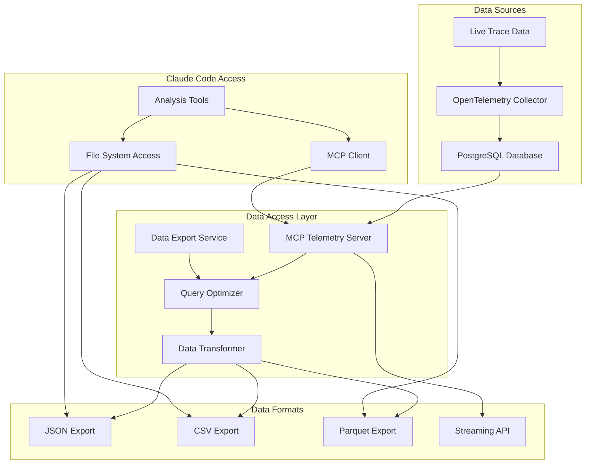
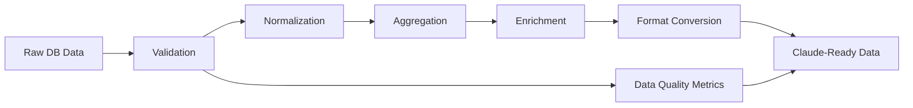
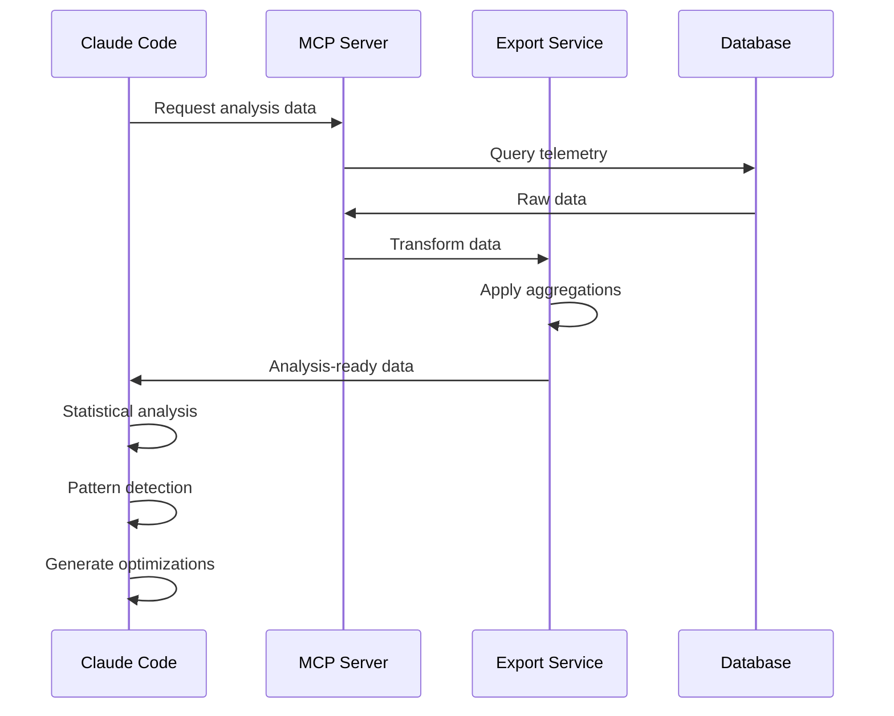

# Data Export/Access Layer Design

## Overview

This document details how Claude Code will access OpenTelemetry data from the PostgreSQL database for autonomous analysis. The design prioritizes efficiency, security, and flexibility while providing Claude with the data it needs to make informed optimization decisions.

## Architecture



## Database Schema Integration

Based on the existing schema, we'll access data from these key tables:

1. **mcpRetrievalBenchmarks** - High-level benchmark data
2. **mcpRetrievalCalls** - Individual MCP call details
3. **tasks** - Task execution context
4. **taskMetrics** - Performance metrics
5. **runs** - Evaluation run metadata

## MCP Telemetry Server

### Implementation

```typescript
// packages/evals/src/autonomous/mcp-telemetry-server.ts
import { Server } from "@modelcontextprotocol/sdk/server/index.js"
import { StdioServerTransport } from "@modelcontextprotocol/sdk/server/stdio.js"
import { drizzle } from "drizzle-orm/postgres-js"
import postgres from "postgres"
import { schema } from "../db/schema.js"

class TelemetryMCPServer {
	private db: ReturnType<typeof drizzle>

	constructor(databaseUrl: string) {
		const client = postgres(databaseUrl)
		this.db = drizzle(client, { schema })
	}

	async initialize() {
		const server = new Server({
			name: "telemetry-db",
			version: "1.0.0",
		})

		// Tool: Query telemetry data
		server.setRequestHandler("tools/list", async () => ({
			tools: [
				{
					name: "query_telemetry",
					description: "Query telemetry data with filters",
					inputSchema: {
						type: "object",
						properties: {
							query_type: {
								type: "string",
								enum: ["benchmarks", "calls", "metrics", "aggregated"],
							},
							filters: {
								type: "object",
								properties: {
									start_date: { type: "string", format: "date-time" },
									end_date: { type: "string", format: "date-time" },
									mcp_server: { type: "string" },
									min_duration: { type: "number" },
									max_duration: { type: "number" },
								},
							},
							aggregation: {
								type: "object",
								properties: {
									group_by: {
										type: "array",
										items: { type: "string" },
									},
									metrics: {
										type: "array",
										items: {
											type: "string",
											enum: ["avg", "min", "max", "p50", "p95", "p99"],
										},
									},
								},
							},
						},
						required: ["query_type"],
					},
				},
				{
					name: "analyze_patterns",
					description: "Analyze patterns in telemetry data",
					inputSchema: {
						type: "object",
						properties: {
							analysis_type: {
								type: "string",
								enum: ["performance_trends", "error_patterns", "usage_patterns"],
							},
							time_window: {
								type: "string",
								enum: ["1h", "24h", "7d", "30d"],
							},
						},
						required: ["analysis_type", "time_window"],
					},
				},
			],
		}))

		// Resource: Telemetry summaries
		server.setRequestHandler("resources/list", async () => ({
			resources: [
				{
					uri: "telemetry://summary/latest",
					name: "Latest Telemetry Summary",
					description: "Summary of the most recent telemetry data",
					mimeType: "application/json",
				},
				{
					uri: "telemetry://export/ready",
					name: "Analysis-Ready Export",
					description: "Pre-processed data ready for analysis",
					mimeType: "application/json",
				},
			],
		}))

		const transport = new StdioServerTransport()
		await server.connect(transport)
	}
}
```

## Data Export Service

### Export Formats

#### 1. JSON Export (Primary Format)

```typescript
// packages/evals/src/autonomous/exporters/JsonExporter.ts
interface TelemetryExport {
	metadata: {
		exportDate: string
		timeRange: { start: Date; end: Date }
		version: string
		dataQuality: {
			completeness: number // 0-1
			sampleSize: number
			missingDataPoints: string[]
		}
	}

	benchmarks: {
		summary: BenchmarkSummary
		details: BenchmarkDetail[]
		trends: TrendAnalysis[]
	}

	performance: {
		byServer: ServerPerformance[]
		byTaskType: TaskTypePerformance[]
		byTimeWindow: TimeWindowPerformance[]
	}

	errors: {
		patterns: ErrorPattern[]
		frequency: ErrorFrequency[]
		impact: ErrorImpact[]
	}

	recommendations: {
		immediate: Recommendation[]
		longTerm: Recommendation[]
	}
}

interface BenchmarkDetail {
	id: number
	mcpServer: string
	taskType: string
	duration: number
	tokenUsage: {
		input: number
		output: number
		total: number
	}
	success: boolean
	errorDetails?: string
	retrievalCalls: {
		count: number
		totalDuration: number
		avgResponseSize: number
	}
}
```

#### 2. CSV Export (For Statistical Analysis)

```typescript
// packages/evals/src/autonomous/exporters/CsvExporter.ts
class CsvExporter {
	async exportBenchmarks(timeRange: TimeRange): Promise<string> {
		const headers = [
			"benchmark_id",
			"timestamp",
			"mcp_server",
			"task_type",
			"duration_ms",
			"tokens_in",
			"tokens_out",
			"success",
			"error_count",
			"retrieval_calls",
			"avg_response_size",
		]

		// Export flattened data for easy analysis
		return this.generateCsv(headers, data)
	}
}
```

#### 3. Streaming API (For Real-time Analysis)

```typescript
// packages/evals/src/autonomous/streaming/TelemetryStream.ts
interface TelemetryStreamEvent {
	type: "benchmark_complete" | "error_detected" | "performance_anomaly"
	timestamp: Date
	data: any
}

class TelemetryStreamServer {
	async streamEvents(filter: StreamFilter): AsyncGenerator<TelemetryStreamEvent> {
		// Stream events as they occur
	}
}
```

## Data Transformation Pipeline



### Key Transformations

1. **Time Series Alignment**

    ```typescript
    // Align data to consistent time buckets for analysis
    function alignTimeSeries(data: RawData[], bucketSize: Duration): AlignedData[] {
    	// Implementation
    }
    ```

2. **Statistical Aggregations**

    ```typescript
    interface StatisticalSummary {
    	mean: number
    	median: number
    	stdDev: number
    	percentiles: { p50: number; p95: number; p99: number }
    	outliers: number[]
    }
    ```

3. **Correlation Analysis**
    ```typescript
    interface CorrelationMatrix {
    	variables: string[]
    	matrix: number[][]
    	significantCorrelations: Array<{
    		var1: string
    		var2: string
    		correlation: number
    		pValue: number
    	}>
    }
    ```

## Access Patterns

### 1. Batch Analysis Access

```bash
# Claude Code accesses exported data files
claude -p "Analyze MCP telemetry data" \
  --mcp-config telemetry-mcp.json \
  --allowedTools "read_file,mcp__telemetry-db__query_telemetry"
```

### 2. Interactive Query Access

```typescript
// Claude uses MCP tools to query specific data
const queryResult = await mcpClient.callTool("telemetry-db", "query_telemetry", {
	query_type: "aggregated",
	filters: {
		start_date: "2024-01-01T00:00:00Z",
		end_date: "2024-01-07T00:00:00Z",
		mcp_server: "exa",
	},
	aggregation: {
		group_by: ["mcp_server", "task_type"],
		metrics: ["avg", "p95", "p99"],
	},
})
```

### 3. Streaming Analysis Access

```typescript
// Claude connects to streaming endpoint for real-time analysis
const stream = await mcpClient.subscribeToResource("telemetry-db", "telemetry://stream/live")
```

## Security & Access Control

### 1. Read-Only Access

- MCP server only provides read access to telemetry data
- No direct database modifications allowed

### 2. Data Filtering

- Sensitive information removed before export
- PII scrubbing applied to all exports

### 3. Rate Limiting

```typescript
interface RateLimits {
	queriesPerMinute: 10
	maxResultSize: 1000000 // 1MB
	maxTimeRange: 30 // days
}
```

## Performance Optimization

### 1. Query Optimization

```sql
-- Materialized views for common aggregations
CREATE MATERIALIZED VIEW mcp_performance_hourly AS
SELECT
  date_trunc('hour', created_at) as hour,
  mcp_server_name,
  COUNT(*) as call_count,
  AVG(response_size) as avg_response_size,
  PERCENTILE_CONT(0.95) WITHIN GROUP (ORDER BY response_size) as p95_response_size
FROM mcp_retrieval_calls
GROUP BY 1, 2;
```

### 2. Caching Strategy

```typescript
interface CacheConfig {
	aggregationCache: {
		ttl: 3600 // 1 hour
		maxSize: "100MB"
	}
	queryCache: {
		ttl: 300 // 5 minutes
		maxSize: "50MB"
	}
}
```

### 3. Incremental Exports

```typescript
// Only export new data since last analysis
interface IncrementalExport {
	lastExportTimestamp: Date
	newDataOnly: boolean
	deltaCalculations: boolean
}
```

## Data Quality Assurance

### 1. Completeness Checks

```typescript
interface DataQualityMetrics {
	missingDataPercentage: number
	outlierPercentage: number
	dataFreshness: Duration
	schemaCompliance: number // 0-1
}
```

### 2. Validation Rules

```typescript
const validationRules = [
	{ field: "duration", min: 0, max: 300000 }, // 5 minutes max
	{ field: "tokens", min: 0, max: 1000000 },
	{ field: "response_size", min: 0, max: 10485760 }, // 10MB max
]
```

## Integration with Claude Code

### 1. Data Analysis Workflow



### 2. Example Claude Analysis Script

```javascript
// Claude's built-in data analysis
async function analyzeTelemetryData(data) {
	// Load data
	const telemetry = JSON.parse(data)

	// Statistical analysis
	const stats = calculateStatistics(telemetry.benchmarks.details)

	// Pattern detection
	const patterns = detectPatterns(telemetry.performance.byServer)

	// Generate recommendations
	const recommendations = generateOptimizations(stats, patterns)

	return {
		analysis: stats,
		patterns: patterns,
		recommendations: recommendations,
		visualizations: createCharts(telemetry),
	}
}
```

## Conclusion

This data export/access layer provides Claude Code with comprehensive, efficient, and secure access to OpenTelemetry data. The combination of MCP server access, file exports, and streaming APIs ensures Claude can perform both batch and real-time analysis to continuously improve the MCP evaluation system.
