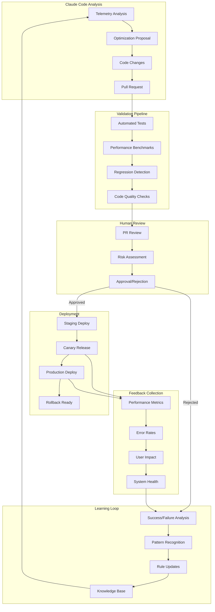

# Feedback Loop Mechanism for Autonomous Improvements

## Overview

This document details the feedback loop mechanism that validates and deploys autonomous improvements made by Claude Code. The system ensures that all changes are thoroughly tested, validated, and safely deployed while maintaining system stability and performance.

## Architecture



## Validation Stages

### 1. Automated Validation

#### Test Suite Execution

```typescript
interface TestValidation {
	unitTests: {
		passed: number
		failed: number
		coverage: number
		duration: number
	}
	integrationTests: {
		passed: number
		failed: number
		scenarios: string[]
	}
	e2eTests?: {
		passed: number
		failed: number
		criticalPaths: string[]
	}
}

async function validateChanges(pr: PullRequest): Promise<ValidationResult> {
	const results = await runTestSuite(pr.branch)

	// Ensure no regression
	if (results.unitTests.failed > 0) {
		return { valid: false, reason: "Unit test failures" }
	}

	// Ensure coverage doesn't decrease
	const baseCoverage = await getBaseBranchCoverage()
	if (results.unitTests.coverage < baseCoverage) {
		return { valid: false, reason: "Coverage regression" }
	}

	return { valid: true, testResults: results }
}
```

#### Performance Benchmarking

```typescript
interface PerformanceBenchmark {
	metric: string
	baseline: number
	current: number
	change: number
	threshold: number
}

async function benchmarkPerformance(changes: CodeChanges): Promise<BenchmarkResult> {
	const benchmarks: PerformanceBenchmark[] = []

	// Run MCP evaluation benchmarks
	const mcpBenchmark = await runMcpBenchmark(changes)
	benchmarks.push({
		metric: "mcp_response_time_p95",
		baseline: mcpBenchmark.baseline.p95,
		current: mcpBenchmark.current.p95,
		change: calculatePercentChange(mcpBenchmark.baseline.p95, mcpBenchmark.current.p95),
		threshold: 5, // Allow 5% degradation
	})

	// Check if any benchmark exceeds threshold
	const regressions = benchmarks.filter((b) => b.change > b.threshold)

	return {
		passed: regressions.length === 0,
		benchmarks,
		regressions,
	}
}
```

#### Static Analysis

```typescript
interface CodeQualityMetrics {
	complexity: {
		cyclomatic: number
		cognitive: number
	}
	maintainability: {
		index: number
		grade: string
	}
	duplication: {
		percentage: number
		blocks: number
	}
	security: {
		vulnerabilities: number
		severity: string[]
	}
}

async function analyzeCodeQuality(files: string[]): Promise<CodeQualityReport> {
	const metrics = await runStaticAnalysis(files)

	const issues = []
	if (metrics.complexity.cyclomatic > 10) {
		issues.push("High cyclomatic complexity")
	}
	if (metrics.duplication.percentage > 5) {
		issues.push("Code duplication detected")
	}
	if (metrics.security.vulnerabilities > 0) {
		issues.push("Security vulnerabilities found")
	}

	return {
		passed: issues.length === 0,
		metrics,
		issues,
	}
}
```

### 2. Staging Validation

#### Deployment to Staging

```yaml
# .github/workflows/staging-deploy.yml
name: Deploy to Staging
on:
    pull_request:
        types: [labeled]

jobs:
    deploy-staging:
        if: contains(github.event.label.name, 'ready-for-staging')
        runs-on: ubuntu-latest
        steps:
            - name: Deploy to Staging
              run: |
                  # Deploy PR branch to staging environment
                  ./scripts/deploy-staging.sh ${{ github.event.pull_request.head.ref }}

            - name: Run Staging Tests
              run: |
                  # Run smoke tests against staging
                  npm run test:staging

            - name: Collect Staging Metrics
              run: |
                  # Collect performance metrics from staging
                  ./scripts/collect-staging-metrics.sh
```

#### Staging Metrics Collection

```typescript
interface StagingMetrics {
	deploymentTime: Date
	healthChecks: {
		endpoint: string
		status: number
		responseTime: number
	}[]
	performanceMetrics: {
		cpuUsage: number
		memoryUsage: number
		requestsPerSecond: number
		errorRate: number
	}
	mcpEvaluations: {
		totalRuns: number
		successRate: number
		avgDuration: number
	}
}

async function collectStagingMetrics(deployment: StagingDeployment): Promise<StagingMetrics> {
	// Run for 1 hour to collect meaningful data
	const duration = 60 * 60 * 1000 // 1 hour
	const startTime = Date.now()

	const metrics: StagingMetrics = {
		deploymentTime: new Date(),
		healthChecks: [],
		performanceMetrics: await collectPerformanceMetrics(duration),
		mcpEvaluations: await runStagingEvaluations(duration),
	}

	return metrics
}
```

### 3. Canary Release

#### Progressive Rollout

```typescript
interface CanaryConfig {
	stages: {
		percentage: number
		duration: number // minutes
		successCriteria: {
			errorRate: number
			p95Latency: number
			successRate: number
		}
	}[]
}

const canaryConfig: CanaryConfig = {
	stages: [
		{
			percentage: 5,
			duration: 30,
			successCriteria: {
				errorRate: 0.01, // 1%
				p95Latency: 1000, // 1s
				successRate: 0.99, // 99%
			},
		},
		{
			percentage: 25,
			duration: 60,
			successCriteria: {
				errorRate: 0.01,
				p95Latency: 1000,
				successRate: 0.99,
			},
		},
		{
			percentage: 50,
			duration: 120,
			successCriteria: {
				errorRate: 0.01,
				p95Latency: 1000,
				successRate: 0.99,
			},
		},
	],
}

async function executeCanaryRelease(version: string): Promise<CanaryResult> {
	for (const stage of canaryConfig.stages) {
		const result = await deployCanaryStage(version, stage)

		if (!meetsSuccessCriteria(result, stage.successCriteria)) {
			await rollbackCanary(version)
			return {
				success: false,
				failedAt: stage.percentage,
				reason: getFailureReason(result, stage.successCriteria),
			}
		}
	}

	return { success: true }
}
```

#### Real-time Monitoring

```typescript
interface CanaryMonitoring {
	metrics: {
		timestamp: Date
		errorRate: number
		latency: {
			p50: number
			p95: number
			p99: number
		}
		throughput: number
	}[]
	alerts: {
		severity: "info" | "warning" | "critical"
		message: string
		timestamp: Date
	}[]
	comparison: {
		baseline: MetricsSummary
		canary: MetricsSummary
		delta: MetricsDelta
	}
}

async function monitorCanary(canaryVersion: string, baselineVersion: string): Promise<CanaryMonitoring> {
	const monitoring = new CanaryMonitor()

	monitoring.on("anomaly", async (anomaly) => {
		if (anomaly.severity === "critical") {
			await initiateRollback(canaryVersion)
		}
	})

	return monitoring.start({
		canaryVersion,
		baselineVersion,
		interval: 60000, // 1 minute
		duration: canaryConfig.stages.reduce((sum, s) => sum + s.duration, 0),
	})
}
```

### 4. Production Deployment

#### Blue-Green Deployment

```typescript
interface BlueGreenDeployment {
	blue: {
		version: string
		status: "active" | "standby"
		health: "healthy" | "unhealthy"
	}
	green: {
		version: string
		status: "active" | "standby"
		health: "healthy" | "unhealthy"
	}
}

async function deployToProduction(newVersion: string): Promise<DeploymentResult> {
	const deployment = await getBlueGreenStatus()
	const targetEnv = deployment.blue.status === "active" ? "green" : "blue"

	// Deploy to standby environment
	await deployToEnvironment(targetEnv, newVersion)

	// Health checks
	const health = await waitForHealthy(targetEnv, {
		timeout: 300000, // 5 minutes
		interval: 10000, // 10 seconds
	})

	if (!health.healthy) {
		return { success: false, reason: "Health check failed" }
	}

	// Switch traffic
	await switchTraffic(targetEnv)

	// Monitor for issues
	const monitoring = await monitorProduction(newVersion, {
		duration: 600000, // 10 minutes
	})

	if (monitoring.hasIssues) {
		await switchTraffic(targetEnv === "blue" ? "green" : "blue")
		return { success: false, reason: "Production issues detected" }
	}

	return { success: true, version: newVersion }
}
```

## Feedback Collection

### 1. Performance Metrics

```typescript
interface PerformanceFeedback {
	mcpCalls: {
		totalCount: number
		avgDuration: number
		p95Duration: number
		errorRate: number
		byServer: Map<string, ServerMetrics>
	}
	systemResources: {
		cpuUsage: number[]
		memoryUsage: number[]
		diskIO: number[]
	}
	userExperience: {
		taskCompletionRate: number
		avgTaskDuration: number
		userReportedIssues: number
	}
}

async function collectPerformanceFeedback(timeRange: TimeRange): Promise<PerformanceFeedback> {
	const telemetry = await queryTelemetryData(timeRange)

	return {
		mcpCalls: analyzeMcpPerformance(telemetry),
		systemResources: analyzeResourceUsage(telemetry),
		userExperience: analyzeUserMetrics(telemetry),
	}
}
```

### 2. Error Analysis

```typescript
interface ErrorFeedback {
	errors: {
		type: string
		count: number
		firstSeen: Date
		lastSeen: Date
		stackTrace?: string
		affectedUsers: number
	}[]
	patterns: {
		recurring: ErrorPattern[]
		new: ErrorPattern[]
		resolved: ErrorPattern[]
	}
	impact: {
		severity: "low" | "medium" | "high" | "critical"
		affectedFeatures: string[]
		estimatedUserImpact: number
	}
}

async function analyzeErrors(deployment: Deployment): Promise<ErrorFeedback> {
	const errors = await collectErrors(deployment)
	const patterns = await identifyErrorPatterns(errors)
	const impact = await assessErrorImpact(errors, patterns)

	return { errors, patterns, impact }
}
```

## Learning Loop

### 1. Success/Failure Analysis

```typescript
interface DeploymentAnalysis {
	deploymentId: string
	changes: {
		files: string[]
		linesAdded: number
		linesRemoved: number
		complexity: number
	}
	validation: {
		testsRun: number
		testsPassed: number
		benchmarkResults: BenchmarkResult[]
	}
	production: {
		deploymentTime: Date
		rollbackRequired: boolean
		performanceImpact: number
		errorRateChange: number
	}
	outcome: "success" | "partial_success" | "failure"
	lessons: string[]
}

async function analyzeDeployment(deploymentId: string): Promise<DeploymentAnalysis> {
	const deployment = await getDeploymentDetails(deploymentId)
	const metrics = await collectDeploymentMetrics(deployment)

	const lessons = extractLessons(deployment, metrics)

	// Store in knowledge base
	await updateKnowledgeBase({
		deployment,
		metrics,
		lessons,
	})

	return {
		deploymentId,
		changes: deployment.changes,
		validation: deployment.validation,
		production: metrics,
		outcome: determineOutcome(metrics),
		lessons,
	}
}
```

### 2. Pattern Recognition

```typescript
interface OptimizationPattern {
	id: string
	type: "performance" | "reliability" | "maintainability"
	description: string
	successRate: number
	applicability: {
		filePatterns: string[]
		codePatterns: string[]
		conditions: string[]
	}
	impact: {
		avgPerformanceGain: number
		avgComplexityReduction: number
		riskLevel: "low" | "medium" | "high"
	}
}

async function identifyPatterns(deployments: DeploymentAnalysis[]): Promise<OptimizationPattern[]> {
	const patterns: OptimizationPattern[] = []

	// Group by optimization type
	const grouped = groupByOptimizationType(deployments)

	for (const [type, group] of grouped) {
		const successfulChanges = group.filter((d) => d.outcome === "success")

		if (successfulChanges.length >= 3) {
			const pattern = extractCommonPattern(successfulChanges)
			if (pattern) {
				patterns.push({
					...pattern,
					successRate: successfulChanges.length / group.length,
				})
			}
		}
	}

	return patterns
}
```

### 3. Rule Updates

```typescript
interface RuleUpdate {
	ruleId: string
	type: "constraint" | "guideline" | "pattern"
	action: "add" | "modify" | "remove"
	before?: string
	after: string
	justification: string
	evidence: {
		deployments: string[]
		metrics: any
	}
}

async function updateAutonomousRules(
	patterns: OptimizationPattern[],
	failures: DeploymentAnalysis[],
): Promise<RuleUpdate[]> {
	const updates: RuleUpdate[] = []

	// Add successful patterns as new guidelines
	for (const pattern of patterns) {
		if (pattern.successRate > 0.8 && pattern.impact.riskLevel === "low") {
			updates.push({
				ruleId: generateRuleId(),
				type: "pattern",
				action: "add",
				after: formatPatternAsRule(pattern),
				justification: `Pattern has ${pattern.successRate * 100}% success rate`,
				evidence: {
					deployments: pattern.deploymentIds,
					metrics: pattern.impact,
				},
			})
		}
	}

	// Add constraints based on failures
	const failurePatterns = analyzeFailures(failures)
	for (const failure of failurePatterns) {
		updates.push({
			ruleId: generateRuleId(),
			type: "constraint",
			action: "add",
			after: formatFailureAsConstraint(failure),
			justification: `Prevent ${failure.type} failures`,
			evidence: {
				deployments: failure.deploymentIds,
				metrics: failure.impact,
			},
		})
	}

	return updates
}
```

## Safety Mechanisms

### 1. Rollback Strategy

```typescript
interface RollbackStrategy {
	automatic: {
		enabled: boolean
		triggers: {
			errorRateThreshold: number
			latencyThreshold: number
			healthCheckFailures: number
		}
		cooldownPeriod: number // minutes
	}
	manual: {
		approvers: string[]
		notificationChannels: string[]
	}
}

async function executeRollback(deployment: Deployment, reason: string): Promise<RollbackResult> {
	// Notify stakeholders
	await notifyRollback(deployment, reason)

	// Execute rollback
	const result = await performRollback(deployment)

	// Verify system health
	const health = await verifySystemHealth()

	// Document for learning
	await documentRollback({
		deployment,
		reason,
		result,
		health,
		timestamp: new Date(),
	})

	return result
}
```

### 2. Circuit Breaker

```typescript
class AutonomousDeploymentCircuitBreaker {
	private failures: number = 0
	private lastFailure?: Date
	private state: "closed" | "open" | "half-open" = "closed"

	async allowDeployment(): Promise<boolean> {
		if (this.state === "open") {
			if (this.shouldAttemptReset()) {
				this.state = "half-open"
			} else {
				return false
			}
		}

		return true
	}

	recordSuccess() {
		this.failures = 0
		this.state = "closed"
	}

	recordFailure() {
		this.failures++
		this.lastFailure = new Date()

		if (this.failures >= 3) {
			this.state = "open"
			this.notifyCircuitOpen()
		}
	}

	private shouldAttemptReset(): boolean {
		if (!this.lastFailure) return false
		const hoursSinceFailure = (Date.now() - this.lastFailure.getTime()) / (1000 * 60 * 60)
		return hoursSinceFailure >= 24 // 24 hour cooldown
	}
}
```

## Integration with Claude Code

### 1. Feedback Integration

```typescript
// packages/evals/src/autonomous/feedback-integration.ts
export async function provideFeedbackToClaude(sessionId: string, feedback: DeploymentFeedback): Promise<void> {
	// Format feedback for Claude's next session
	const context = {
		previousSession: sessionId,
		deploymentOutcome: feedback.outcome,
		performanceMetrics: feedback.metrics,
		lessonsLearned: feedback.lessons,
		updatedRules: feedback.ruleUpdates,
	}

	// Store for next Claude session
	await storeFeedbackContext(context)

	// Update CLAUDE.md if needed
	if (feedback.ruleUpdates.length > 0) {
		await updateClaudeMdFile(feedback.ruleUpdates)
	}
}
```

### 2. Continuous Improvement

```typescript
interface ImprovementCycle {
	analyze: () => Promise<AnalysisResult>
	propose: (analysis: AnalysisResult) => Promise<Proposal>
	implement: (proposal: Proposal) => Promise<Implementation>
	validate: (implementation: Implementation) => Promise<Validation>
	deploy: (validation: Validation) => Promise<Deployment>
	learn: (deployment: Deployment) => Promise<Lessons>
}

const autonomousImprovementCycle: ImprovementCycle = {
	analyze: async () => await claudeAnalyzeTelemetry(),
	propose: async (analysis) => await claudeProposeOptimizations(analysis),
	implement: async (proposal) => await claudeImplementChanges(proposal),
	validate: async (implementation) => await runValidationPipeline(implementation),
	deploy: async (validation) => await executeDeployment(validation),
	learn: async (deployment) => await extractAndStoreLessons(deployment),
}
```

## Conclusion

This feedback loop mechanism ensures that autonomous improvements are thoroughly validated, safely deployed, and continuously refined based on real-world results. The system balances automation with human oversight, enabling Claude Code to learn and improve while maintaining system stability and reliability.
