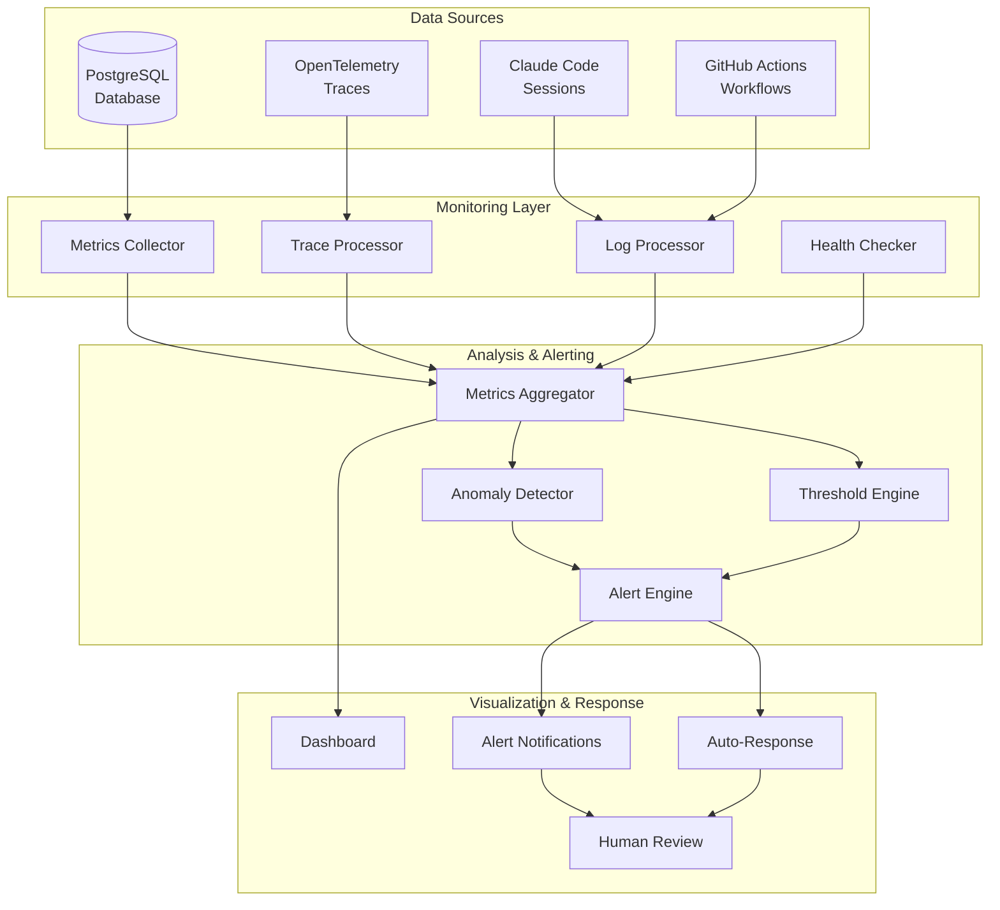

# Monitoring and Alerting Strategy for Autonomous MCP Optimization System

## Overview

This document outlines a comprehensive monitoring and alerting strategy for the autonomous MCP optimization system. The strategy leverages existing infrastructure while adding specialized monitoring for autonomous operations, ensuring system health, safety, and effectiveness.

## Architecture



## Key Metrics

### 1. System Health Metrics

```typescript
interface SystemHealthMetrics {
	// Resource utilization
	database: {
		connectionCount: number
		queryLatency: number
		storageUsage: number
		deadlockCount: number
	}

	// OpenTelemetry pipeline
	telemetry: {
		spanProcessingRate: number
		spanDropRate: number
		exporterErrors: number
		bufferUtilization: number
	}

	// MCP servers
	mcpServers: {
		[serverName: string]: {
			status: "connected" | "disconnected" | "error"
			responseTime: number
			errorRate: number
			requestCount: number
		}
	}
}
```

### 2. Autonomous Operation Metrics

```typescript
interface AutonomousOperationMetrics {
	// Claude Code sessions
	sessions: {
		total: number
		active: number
		completed: number
		failed: number
		averageDuration: number
		tokenUsage: {
			input: number
			output: number
			cost: number
		}
	}

	// Analysis quality
	analysis: {
		insightsGenerated: number
		patternsIdentified: number
		recommendationsProposed: number
		confidenceScores: number[]
	}

	// Improvement tracking
	improvements: {
		proposed: number
		validated: number
		deployed: number
		rolledBack: number
		performanceGain: number
	}
}
```

### 3. Safety Metrics

```typescript
interface SafetyMetrics {
	// Constraint violations
	violations: {
		readOnlyViolations: number
		scopeViolations: number
		resourceLimitViolations: number
		timeoutViolations: number
	}

	// Review requirements
	reviews: {
		pending: number
		approved: number
		rejected: number
		averageReviewTime: number
	}

	// Rollback tracking
	rollbacks: {
		automatic: number
		manual: number
		successRate: number
		averageRecoveryTime: number
	}
}
```

### 4. Business Impact Metrics

```typescript
interface BusinessImpactMetrics {
	// Code quality improvements
	codeQuality: {
		testPassRate: number
		lintErrorReduction: number
		performanceImprovement: number
		reliabilityScore: number
	}

	// MCP optimization
	mcpOptimization: {
		queryEfficiency: number
		responseTimeReduction: number
		costSavings: number
		accuracyImprovement: number
	}

	// Developer experience
	developerExperience: {
		taskCompletionTime: number
		errorRate: number
		userSatisfaction: number
	}
}
```

## Monitoring Implementation

### 1. Metrics Collection

```typescript
// packages/evals/src/monitoring/MetricsCollector.ts
export class MetricsCollector {
	private readonly db: Database
	private readonly telemetryClient: TelemetryClient
	private readonly interval: number = 60000 // 1 minute

	async collectSystemHealth(): Promise<SystemHealthMetrics> {
		const [dbMetrics, telemetryMetrics, mcpMetrics] = await Promise.all([
			this.collectDatabaseMetrics(),
			this.collectTelemetryMetrics(),
			this.collectMcpServerMetrics(),
		])

		return {
			database: dbMetrics,
			telemetry: telemetryMetrics,
			mcpServers: mcpMetrics,
		}
	}

	async collectAutonomousMetrics(): Promise<AutonomousOperationMetrics> {
		// Query database for session metrics
		const sessions = await this.db.select().from(claudeSessions).where(/* recent sessions */)

		// Aggregate analysis metrics
		const analysis = await this.aggregateAnalysisMetrics()

		// Track improvements
		const improvements = await this.trackImprovements()

		return { sessions, analysis, improvements }
	}
}
```

### 2. Health Checks

```typescript
// packages/evals/src/monitoring/HealthChecker.ts
export class HealthChecker {
	async checkSystem(): Promise<HealthStatus> {
		const checks = await Promise.allSettled([
			this.checkDatabase(),
			this.checkOpenTelemetry(),
			this.checkMcpServers(),
			this.checkGitHubActions(),
		])

		return {
			status: this.aggregateStatus(checks),
			checks: this.formatChecks(checks),
			timestamp: new Date(),
		}
	}

	private async checkDatabase(): Promise<ComponentHealth> {
		try {
			const start = Date.now()
			await this.db.execute(sql`SELECT 1`)
			const latency = Date.now() - start

			return {
				component: "database",
				status: latency < 100 ? "healthy" : "degraded",
				latency,
				details: { connectionCount: await this.getConnectionCount() },
			}
		} catch (error) {
			return {
				component: "database",
				status: "unhealthy",
				error: error.message,
			}
		}
	}
}
```

### 3. Anomaly Detection

```typescript
// packages/evals/src/monitoring/AnomalyDetector.ts
export class AnomalyDetector {
	private readonly thresholds: ThresholdConfig
	private readonly historicalData: HistoricalDataStore

	async detectAnomalies(metrics: AllMetrics): Promise<Anomaly[]> {
		const anomalies: Anomaly[] = []

		// Statistical anomaly detection
		anomalies.push(...(await this.detectStatisticalAnomalies(metrics)))

		// Pattern-based detection
		anomalies.push(...(await this.detectPatternAnomalies(metrics)))

		// Threshold violations
		anomalies.push(...this.detectThresholdViolations(metrics))

		return anomalies
	}

	private async detectStatisticalAnomalies(metrics: AllMetrics): Promise<Anomaly[]> {
		// Use z-score or IQR methods for outlier detection
		const anomalies: Anomaly[] = []

		// Example: Detect unusual token usage
		const tokenHistory = await this.historicalData.getTokenUsage(30) // 30 days
		const mean = average(tokenHistory)
		const stdDev = standardDeviation(tokenHistory)
		const zScore = (metrics.sessions.tokenUsage.total - mean) / stdDev

		if (Math.abs(zScore) > 3) {
			anomalies.push({
				type: "statistical",
				metric: "token_usage",
				severity: "warning",
				value: metrics.sessions.tokenUsage.total,
				expected: mean,
				deviation: zScore,
			})
		}

		return anomalies
	}
}
```

## Alert Configuration

### 1. Alert Rules

```yaml
# packages/evals/config/alerts.yaml
alerts:
    # Critical alerts (immediate response required)
    critical:
        - name: database_down
          condition: health.database.status == 'unhealthy'
          duration: 1m
          channels: ["pagerduty", "slack-critical"]

        - name: autonomous_session_failure_spike
          condition: metrics.sessions.failureRate > 0.5
          duration: 5m
          channels: ["pagerduty", "slack-critical"]

        - name: safety_violation_critical
          condition: metrics.violations.total > 10
          duration: 1m
          channels: ["pagerduty", "slack-critical", "email-security"]

    # Warning alerts (attention needed)
    warning:
        - name: high_token_usage
          condition: metrics.sessions.tokenUsage.cost > dailyBudget * 0.8
          duration: 10m
          channels: ["slack-ops", "email-finance"]

        - name: mcp_server_degraded
          condition: any(metrics.mcpServers.*.errorRate > 0.1)
          duration: 15m
          channels: ["slack-ops"]

        - name: review_backlog
          condition: metrics.reviews.pending > 20
          duration: 30m
          channels: ["slack-dev", "email-leads"]

    # Info alerts (awareness only)
    info:
        - name: improvement_deployed
          condition: event.type == 'improvement_deployed'
          channels: ["slack-general"]

        - name: analysis_complete
          condition: event.type == 'analysis_session_complete'
          channels: ["slack-analytics"]
```

### 2. Alert Channels

```typescript
// packages/evals/src/monitoring/AlertChannels.ts
export interface AlertChannel {
	send(alert: Alert): Promise<void>
}

export class SlackChannel implements AlertChannel {
	constructor(
		private readonly webhookUrl: string,
		private readonly channel: string,
	) {}

	async send(alert: Alert): Promise<void> {
		const message = this.formatAlert(alert)
		await fetch(this.webhookUrl, {
			method: "POST",
			headers: { "Content-Type": "application/json" },
			body: JSON.stringify({
				channel: this.channel,
				username: "Autonomous System Monitor",
				icon_emoji: this.getAlertEmoji(alert.severity),
				attachments: [
					{
						color: this.getAlertColor(alert.severity),
						title: alert.name,
						text: alert.description,
						fields: this.formatMetrics(alert.metrics),
						ts: Math.floor(Date.now() / 1000),
					},
				],
			}),
		})
	}
}

export class PagerDutyChannel implements AlertChannel {
	async send(alert: Alert): Promise<void> {
		// Create PagerDuty incident for critical alerts
		await this.client.createIncident({
			title: alert.name,
			service: "autonomous-mcp-system",
			urgency: this.mapSeverity(alert.severity),
			body: {
				type: "incident_body",
				details: alert.description,
			},
		})
	}
}
```

## Dashboard Design

### 1. Executive Dashboard

```typescript
// packages/evals/src/monitoring/dashboards/ExecutiveDashboard.ts
export const executiveDashboard: DashboardConfig = {
	name: "Autonomous System Executive View",
	refreshInterval: 60000,
	layout: [
		{
			type: "scorecard",
			title: "System Health",
			metrics: ["overall_health_score", "uptime_percentage"],
			position: { x: 0, y: 0, w: 6, h: 2 },
		},
		{
			type: "timeseries",
			title: "Improvement Impact",
			metrics: ["performance_gain", "cost_savings"],
			timeRange: "7d",
			position: { x: 6, y: 0, w: 6, h: 4 },
		},
		{
			type: "gauge",
			title: "Safety Score",
			metric: "safety_compliance_rate",
			thresholds: { good: 95, warning: 90, critical: 80 },
			position: { x: 0, y: 2, w: 3, h: 2 },
		},
		{
			type: "counter",
			title: "Improvements This Month",
			metric: "monthly_improvements_deployed",
			position: { x: 3, y: 2, w: 3, h: 2 },
		},
	],
}
```

### 2. Operations Dashboard

```typescript
// packages/evals/src/monitoring/dashboards/OperationsDashboard.ts
export const operationsDashboard: DashboardConfig = {
	name: "Autonomous System Operations",
	refreshInterval: 30000,
	layout: [
		{
			type: "status_grid",
			title: "Component Status",
			components: ["database", "opentelemetry", "mcp_servers", "github_actions"],
			position: { x: 0, y: 0, w: 12, h: 2 },
		},
		{
			type: "log_stream",
			title: "Recent Sessions",
			source: "claude_sessions",
			filters: ["status", "duration", "token_usage"],
			position: { x: 0, y: 2, w: 6, h: 4 },
		},
		{
			type: "heatmap",
			title: "MCP Server Performance",
			metric: "mcp_response_time",
			dimensions: ["server", "hour_of_day"],
			position: { x: 6, y: 2, w: 6, h: 4 },
		},
		{
			type: "alert_list",
			title: "Active Alerts",
			severities: ["critical", "warning"],
			position: { x: 0, y: 6, w: 12, h: 3 },
		},
	],
}
```

## Auto-Response Mechanisms

### 1. Automatic Remediation

```typescript
// packages/evals/src/monitoring/AutoResponse.ts
export class AutoResponseEngine {
	private readonly actions: Map<string, RemediationAction> = new Map([
		["high_memory_usage", this.restartWorker],
		["mcp_connection_lost", this.reconnectMcpServer],
		["token_limit_approaching", this.pauseAutonomousSessions],
		["safety_violation", this.emergencyStop],
	])

	async handleAlert(alert: Alert): Promise<RemediationResult> {
		const action = this.actions.get(alert.type)
		if (!action) {
			return { handled: false, reason: "No auto-response configured" }
		}

		try {
			const result = await action(alert)
			await this.notifyRemediation(alert, result)
			return { handled: true, result }
		} catch (error) {
			await this.escalateToHuman(alert, error)
			return { handled: false, error }
		}
	}

	private async emergencyStop(alert: Alert): Promise<void> {
		// Immediately stop all autonomous operations
		await this.db
			.update(claudeSessions)
			.set({ status: "emergency_stopped" })
			.where(eq(claudeSessions.status, "active"))

		// Disable GitHub Actions workflows
		await this.github.disableWorkflow("autonomous-analysis")

		// Send critical notifications
		await this.notifyEmergencyStop(alert)
	}
}
```

### 2. Escalation Policies

```typescript
// packages/evals/src/monitoring/EscalationPolicy.ts
export class EscalationPolicy {
	private readonly levels: EscalationLevel[] = [
		{
			level: 1,
			delay: 0,
			contacts: ["on-call-engineer"],
			channels: ["slack-ops"],
		},
		{
			level: 2,
			delay: 15 * 60 * 1000, // 15 minutes
			contacts: ["team-lead", "on-call-engineer"],
			channels: ["slack-ops", "pagerduty"],
		},
		{
			level: 3,
			delay: 60 * 60 * 1000, // 1 hour
			contacts: ["engineering-manager", "team-lead"],
			channels: ["pagerduty", "phone"],
		},
	]

	async escalate(alert: Alert): Promise<void> {
		for (const level of this.levels) {
			if (alert.acknowledgedAt) break

			await this.notifyLevel(alert, level)
			await this.wait(level.delay)
		}
	}
}
```

## Integration with Existing Systems

### 1. TelemetryClient Integration

```typescript
// Extend existing TelemetryClient
export class MonitoringTelemetryClient extends TelemetryClient {
	async captureMetric(metric: Metric): Promise<void> {
		// Send to existing telemetry pipeline
		await super.capture({
			event: "metric",
			properties: {
				name: metric.name,
				value: metric.value,
				tags: metric.tags,
				timestamp: metric.timestamp,
			},
		})

		// Also send to monitoring system
		await this.metricsCollector.record(metric)
	}
}
```

### 2. OpenTelemetry Integration

```typescript
// Add monitoring span processor
export class MonitoringSpanProcessor implements SpanProcessor {
	onEnd(span: ReadableSpan): void {
		// Extract monitoring-relevant data
		if (span.name.startsWith("claude.")) {
			this.recordClaudeMetrics(span)
		} else if (span.name.startsWith("mcp.")) {
			this.recordMcpMetrics(span)
		}
	}

	private recordClaudeMetrics(span: ReadableSpan): void {
		const metrics = {
			duration: span.duration,
			tokenUsage: span.attributes["claude.token_usage"],
			success: span.status.code === SpanStatusCode.OK,
		}

		this.metricsCollector.record("claude_session", metrics)
	}
}
```

## Monitoring Best Practices

### 1. Metric Collection Guidelines

- **Sampling**: Use appropriate sampling rates to balance detail vs. overhead
- **Aggregation**: Pre-aggregate metrics at collection time for efficiency
- **Retention**: Define retention policies based on metric importance
- **Cardinality**: Limit label cardinality to prevent metric explosion

### 2. Alert Tuning

- **Threshold Calibration**: Use historical data to set appropriate thresholds
- **Alert Fatigue**: Minimize false positives through proper tuning
- **Actionability**: Ensure every alert has a clear remediation path
- **Documentation**: Include runbooks for each alert type

### 3. Dashboard Design

- **Hierarchy**: Start with high-level views, allow drill-down
- **Context**: Include relevant context and comparisons
- **Performance**: Optimize queries for dashboard responsiveness
- **Mobile**: Ensure critical dashboards work on mobile devices

## Security Considerations

### 1. Access Control

```typescript
// Role-based dashboard access
export const dashboardAccess = {
	executive: ["executive_dashboard", "safety_overview"],
	operations: ["operations_dashboard", "alert_management", "system_health"],
	developer: ["technical_dashboard", "trace_explorer", "log_viewer"],
	security: ["security_dashboard", "audit_logs", "compliance_reports"],
}
```

### 2. Audit Logging

```typescript
// Audit all monitoring actions
export class MonitoringAuditLogger {
	async logAction(action: MonitoringAction): Promise<void> {
		await this.db.insert(auditLogs).values({
			timestamp: new Date(),
			actor: action.actor,
			action: action.type,
			target: action.target,
			details: action.details,
			ip: action.ipAddress,
		})
	}
}
```

## Implementation Timeline

### Phase 1: Foundation (Week 1-2)

- Set up metrics collection infrastructure
- Implement basic health checks
- Create initial dashboards

### Phase 2: Alerting (Week 3-4)

- Configure alert rules
- Set up notification channels
- Implement escalation policies

### Phase 3: Advanced Monitoring (Week 5-6)

- Deploy anomaly detection
- Add predictive analytics
- Implement auto-response mechanisms

### Phase 4: Integration (Week 7-8)

- Integrate with existing systems
- Complete security implementation
- Conduct monitoring drills

## Success Metrics

1. **Mean Time to Detection (MTTD)**: < 5 minutes for critical issues
2. **Mean Time to Resolution (MTTR)**: < 30 minutes for auto-remediable issues
3. **Alert Accuracy**: > 95% true positive rate
4. **Dashboard Load Time**: < 2 seconds for all dashboards
5. **Monitoring Coverage**: 100% of critical components monitored

## Conclusion

This monitoring and alerting strategy provides comprehensive observability for the autonomous MCP optimization system. By leveraging existing infrastructure and adding specialized monitoring capabilities, we ensure the system operates safely, efficiently, and effectively while maintaining full visibility into its behavior and impact.
