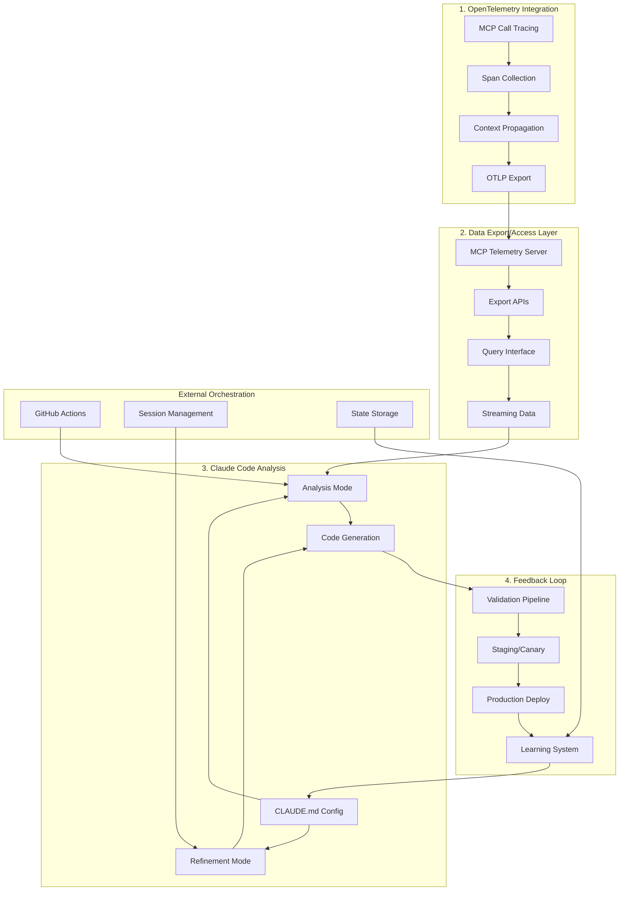

# Autonomous Analysis System - Integration Overview

## Complete System Architecture



## Integration Points

### 1. OpenTelemetry → Data Access

```typescript
// Telemetry flows from MCP calls to storage
interface TelemetryFlow {
	source: "MCP Hub" | "Evaluation Runner"
	collection: "OpenTelemetry SDK"
	export: "OTLP/HTTP"
	storage: "PostgreSQL"
	access: "MCP Server" | "Export API"
}
```

### 2. Data Access → Claude Code

```typescript
// Claude accesses telemetry data for analysis
interface DataAccess {
	method: "MCP Server" | "Exported Files"
	format: "JSON" | "CSV" | "Streaming"
	authentication: "API Key" | "Session Token"
	rateLimit: "1000 req/hour"
}
```

### 3. Claude Code → Feedback Loop

```typescript
// Claude's changes enter validation pipeline
interface ChangeFlow {
	source: "Claude Code PR"
	validation: "Automated Tests"
	staging: "Deployment & Monitoring"
	production: "Canary → Full"
	feedback: "Metrics & Learning"
}
```

### 4. Feedback Loop → Claude Code

```typescript
// Learning informs future Claude sessions
interface LearningFlow {
	metrics: "Performance & Errors"
	patterns: "Success & Failure Analysis"
	rules: "Updated Constraints"
	context: "Next Session State"
}
```

## Key Design Decisions

### 1. Stateless Claude Sessions

- Each Claude session starts fresh
- Context provided via:
    - Updated CLAUDE.md
    - Previous session summaries
    - Current telemetry data
    - Learned patterns

### 2. Human-Triggered Execution

- No 24/7 autonomous operation
- Manual triggers via:
    - GitHub Actions workflow dispatch
    - CLI commands
    - Web interface

### 3. Progressive Safety

- Analysis-only mode for exploration
- Refinement mode requires approval
- All changes go through PR process
- Multiple validation stages

### 4. Continuous Learning

- Every deployment provides feedback
- Patterns recognized and codified
- Rules updated based on outcomes
- Knowledge base grows over time

## Implementation Phases

### Phase 1: Foundation (Weeks 1-2)

1. Complete OpenTelemetry integration
2. Basic data export functionality
3. Initial CLAUDE.md configuration
4. Simple validation pipeline

### Phase 2: Core Loop (Weeks 3-4)

1. MCP telemetry server
2. Claude Code integration
3. Basic feedback collection
4. Manual deployment process

### Phase 3: Automation (Weeks 5-6)

1. GitHub Actions orchestration
2. Automated validation pipeline
3. Staging deployment automation
4. Basic canary releases

### Phase 4: Intelligence (Weeks 7-8)

1. Pattern recognition system
2. Learning loop implementation
3. Rule update automation
4. Advanced monitoring

### Phase 5: Refinement (Weeks 9-10)

1. Performance optimization
2. Safety mechanism tuning
3. UI/UX improvements
4. Documentation and training

## Success Metrics

### Technical Metrics

- Telemetry capture rate: >99%
- Analysis accuracy: >90%
- Deployment success rate: >95%
- Rollback frequency: <5%

### Business Metrics

- MCP performance improvement: >20%
- Code quality improvement: >15%
- Development velocity increase: >10%
- Incident reduction: >30%

### Learning Metrics

- Patterns identified: >50
- Rules refined: >20
- Successful optimizations: >100
- Knowledge base growth: 2x

## Risk Mitigation

### Technical Risks

1. **Data Loss**: Multiple backup strategies
2. **Bad Deployments**: Comprehensive rollback
3. **Performance Regression**: Continuous monitoring
4. **Security Vulnerabilities**: Static analysis

### Operational Risks

1. **Over-automation**: Human approval gates
2. **Alert Fatigue**: Smart notification routing
3. **Knowledge Silos**: Comprehensive documentation
4. **Team Resistance**: Gradual rollout

## Next Steps

1. **Review and Refine**: Gather feedback on all four design documents
2. **Prioritize Features**: Determine MVP vs. future enhancements
3. **Create POC**: Build minimal proof-of-concept
4. **Plan Implementation**: Detailed sprint planning
5. **Begin Development**: Start with OpenTelemetry integration

## Conclusion

This autonomous analysis system represents a significant advancement in how we optimize MCP server performance. By combining comprehensive telemetry, intelligent analysis, rigorous validation, and continuous learning, we create a system that improves itself while maintaining safety and reliability.

The modular design allows for incremental implementation and testing, reducing risk while delivering value early. The emphasis on human oversight and progressive automation ensures that the system enhances rather than replaces human judgment.

With careful implementation and monitoring, this system will dramatically improve our ability to optimize MCP server interactions, leading to better performance, reliability, and user experience.
