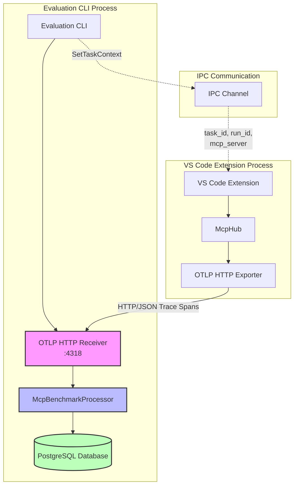
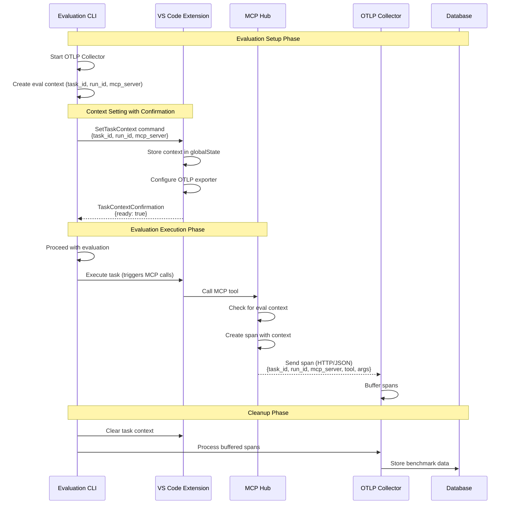
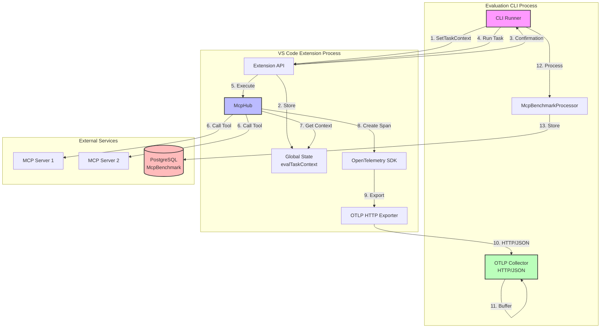

# OpenTelemetry Integration Plan for MCP Retrieval Benchmarking

## Overview

This document outlines the implementation plan for integrating OpenTelemetry into the Roo Code evaluation system to capture real MCP (Model Context Protocol) call data during evaluation runs. The goal is to establish a trace pipeline that captures MCP server interactions and stores them in the database for analysis.

This implementation uses an **all-HTTP approach** for OTLP (OpenTelemetry Protocol) transport, aligning with the streamable HTTP standard that is becoming prevalent in MCP implementations.

## Validation Summary (Updated)

Based on code analysis, the following findings have been confirmed:

### ✅ Accurate Elements:

1. **McpBenchmarkProcessor** exists and implements the correct interface
2. **Database schema** has the required tables (`mcpRetrievalBenchmarks`, `mcpRetrievalCalls`)
3. **McpHub** already has OpenTelemetry integration via `McpTraceManager`
4. **IPC infrastructure** exists with proper message types
5. **Architecture diagrams** accurately represent the intended flow
6. **HTTP/OTLP approach** aligns with existing patterns
7. **Task ID mapping solution** - `McpBenchmarkProcessor` already has `taskIdMapping` Map and `registerTaskIdMapping` method to handle string-to-integer conversion

### ❌ Inaccuracies Requiring Implementation:

1. **SetTaskContext command doesn't exist** - Must be added to `TaskCommandName` enum
2. **Missing confirmation message type** - `TaskContextConfirmationMessage` needs to be created

### 🔧 Required Adjustments:

The plan correctly identifies the race condition problem and proposes a valid solution. Implementation requires:

1. Adding `SetTaskContext` to the `TaskCommandName` enum
2. Creating the `TaskContextConfirmationMessage` type
3. Implementing the command handler in the VS Code extension
4. Adding the confirmation protocol logic
5. Using the existing `registerTaskIdMapping` method in `McpBenchmarkProcessor` to handle the task ID type mismatch

## Architecture



## Implementation Steps

### 1. Create OpenTelemetry Initialization Module

**File**: `packages/evals/src/telemetry/initializeOtel.ts`

```typescript
import { NodeSDK } from "@opentelemetry/sdk-node"
import { OTLPTraceExporter } from "@opentelemetry/exporter-trace-otlp-http"
import { Resource } from "@opentelemetry/resources"
import { SemanticResourceAttributes } from "@opentelemetry/semantic-conventions"
import { McpBenchmarkProcessor } from "../benchmark/McpBenchmarkProcessor"
import { BatchSpanProcessor } from "@opentelemetry/sdk-trace-base"

export function initializeOpenTelemetry(port: number = 4318) {
	// Use HTTP exporter for all-HTTP setup
	const traceExporter = new OTLPTraceExporter({
		url: `http://localhost:${port}/v1/traces`,
		headers: {
			"Content-Type": "application/json",
		},
	})

	const mcpProcessor = new McpBenchmarkProcessor()

	// Add batch processor for efficient HTTP transport
	const batchProcessor = new BatchSpanProcessor(traceExporter, {
		maxQueueSize: 2048,
		maxExportBatchSize: 512,
		scheduledDelayMillis: 5000,
	})

	const sdk = new NodeSDK({
		resource: new Resource({
			[SemanticResourceAttributes.SERVICE_NAME]: "roo-code-evals",
			[SemanticResourceAttributes.SERVICE_VERSION]: "1.0.0",
		}),
		spanProcessors: [mcpProcessor, batchProcessor],
	})

	sdk.start()

	return {
		sdk,
		port,
		shutdown: () => sdk.shutdown(),
	}
}
```

### 2. Add IPC Message Types

**File**: `packages/types/src/ipc.ts`

Add new command to enum and create message types:

```typescript
export enum TaskCommandName {
	// ... existing commands
	SetTaskContext = "setTaskContext",
}

export interface SetTaskContextData {
	taskId: number // Database task ID (integer)
	rooTaskId: string // Roo's internal task ID (string)
	runId: number
	mcpServer: string
	userIntent: string
}

export interface TaskContextConfirmationMessage extends BaseMessage {
	type: MessageType.TaskContextConfirmation
	data: {
		taskId: number
		success: boolean
		error?: string
	}
}
```

Note: We include both `taskId` (database integer) and `rooTaskId` (Roo's string ID) to handle the type mismatch. The `McpBenchmarkProcessor` already has a `registerTaskIdMapping` method to map between these.

### 3. Update Evaluation CLI

**File**: `packages/evals/src/cli/index.ts`

Key changes:

- Initialize OpenTelemetry before running evaluations
- Generate Roo's internal task ID (string) for each task
- Send task context with confirmation protocol
- Register task ID mapping in the processor
- Ensure proper shutdown of OpenTelemetry

```typescript
import { initializeOpenTelemetry } from "../telemetry/initializeOtel"
import { v4 as uuidv4 } from "uuid"

// In runTask function:
async function runTask(task: Task, client: RelayClient): Promise<void> {
	// Generate Roo's internal task ID (string format)
	const rooTaskId = uuidv4()

	// Send SetTaskContext and wait for confirmation
	const contextSet = await setTaskContextWithConfirmation(task, rooTaskId, client)
	if (!contextSet) {
		throw new Error(`Failed to set task context for task ${task.id}`)
	}

	// Now safe to proceed with evaluation
	// ... rest of evaluation logic
}

async function setTaskContextWithConfirmation(task: Task, rooTaskId: string, client: RelayClient): Promise<boolean> {
	return new Promise((resolve) => {
		const timeout = setTimeout(() => {
			console.error(`Timeout waiting for task context confirmation for task ${task.id}`)
			resolve(false)
		}, 5000)

		// Set up one-time listener for confirmation
		const confirmationHandler = (message: TaskContextConfirmationMessage) => {
			if (message.data.taskId === task.id) {
				clearTimeout(timeout)
				client.off("taskContextConfirmation", confirmationHandler)
				resolve(message.data.success)
			}
		}

		client.on("taskContextConfirmation", confirmationHandler)

		// Send SetTaskContext command
		client.send({
			type: MessageType.Task,
			origin: IpcOrigin.Server,
			data: {
				command: TaskCommandName.SetTaskContext,
				taskId: task.id, // Database integer ID
				rooTaskId: rooTaskId, // Roo's string ID
				runId: task.runId,
				mcpServer: task.mcpServer || "default",
				userIntent: task.userIntent,
			},
		})
	})
}
```

### 4. Handle Task Context Race Condition

**Critical Issue**: There's a race condition where MCP calls may happen before the task context is set in VS Code's global state. This would cause spans to be missing task_id and run_id, making them unusable for benchmarking.

**Solution**: Implement a handshake protocol to ensure task context is set before evaluation proceeds.

#### Option 1: Context Confirmation Protocol (Recommended)

**File**: `packages/types/src/ipc/messages.ts`

Add confirmation message:

```typescript
export interface TaskContextConfirmationMessage {
	type: "taskContextConfirmation"
	taskId: string
	runId: string
	ready: boolean
}
```

**File**: `packages/evals/src/cli/index.ts`

Wait for confirmation:

```typescript
// In runEvaluation function:
async function runEvaluation(options: EvaluationOptions) {
	// Initialize OpenTelemetry
	const otel = initializeOpenTelemetry()

	try {
		// ... existing code ...

		// Send task context and wait for confirmation
		const contextReady = await new Promise<boolean>((resolve) => {
			const timeout = setTimeout(() => {
				console.warn("Task context confirmation timeout")
				resolve(false)
			}, 5000) // 5 second timeout

			// Set up one-time listener for confirmation
			const confirmationHandler = (msg: any) => {
				if (msg.type === "taskContextConfirmation" && msg.taskId === currentTask.id && msg.runId === run.id) {
					clearTimeout(timeout)
					resolve(msg.ready)
				}
			}

			// Register handler before sending message
			ipcChannel.on("message", confirmationHandler)

			// Send task context
			sendMessage({
				type: "setTaskContext",
				taskId: currentTask.id,
				runId: run.id,
				mcpServer: options.mcpServer,
				otlpEndpoint: `http://localhost:${otel.port}`,
			})
		})

		if (!contextReady) {
			throw new Error("Failed to set task context in VS Code")
		}

		// Now safe to proceed with evaluation
		// ... rest of evaluation ...
	} finally {
		await otel.shutdown()
	}
}
```

## 4. Race Condition: Task Context Setting

### Problem

The evaluation CLI currently sends a `StartNewTask` message to VS Code but has no mechanism to pass evaluation-specific context (task_id, run_id, mcp_server). Even if we add a `setTaskContext` message, if sent in a fire-and-forget manner, the evaluation might start making MCP calls before VS Code has processed the message and updated the global state. This causes MCP spans to miss critical task context attributes.

### Root Cause Analysis

After examining the code:

- The CLI only sends `StartNewTask`, `CancelTask`, and `CloseTask` commands
- There is no `SetTaskContext` command in the `TaskCommandName` enum
- MCP calls pass `cline.taskId` which is the regular Roo Code task ID, not evaluation-specific
- Without a confirmation protocol, there's no guarantee context is set before MCP calls begin

### Solution: Add SetTaskContext Command with Confirmation Protocol

#### 1. Add new types in `packages/types`:

```typescript
// In packages/types/src/ipc/messages.ts
export enum TaskCommandName {
	StartNewTask = "StartNewTask",
	CancelTask = "CancelTask",
	CloseTask = "CloseTask",
	SetTaskContext = "SetTaskContext", // NEW
}

// New interface for eval task context
export interface EvalTaskContext {
	task_id: string
	run_id: string
	mcp_server: string
}

// New confirmation message type
export interface TaskContextConfirmationMessage {
	type: IpcMessageType.TaskContextConfirmation
	taskId: string
	runId: string
	ready: boolean
}
```

#### 2. Update CLI to send context and wait for confirmation:

```typescript
// In packages/evals/src/cli/index.ts
async function setTaskContextAndWait(client: IpcClient, context: EvalTaskContext): Promise<void> {
	return new Promise((resolve, reject) => {
		const timeout = setTimeout(() => {
			reject(new Error("Timeout waiting for task context confirmation"))
		}, 5000)

		const handler = (message: any) => {
			if (
				message.type === IpcMessageType.TaskContextConfirmation &&
				message.taskId === context.task_id &&
				message.runId === context.run_id
			) {
				clearTimeout(timeout)
				client.off("message", handler)
				if (message.ready) {
					resolve()
				} else {
					reject(new Error("Failed to set task context in VS Code"))
				}
			}
		}

		client.on("message", handler)

		// Send the SetTaskContext command
		client.sendMessage({
			type: IpcMessageType.TaskCommand,
			origin: IpcOrigin.Client,
			clientId: client.clientId!,
			data: {
				commandName: TaskCommandName.SetTaskContext,
				data: context,
			},
		})
	})
}

// Use in evaluation flow:
async function runEvaluation() {
	// ... existing setup ...

	// Set task context before starting evaluation
	await setTaskContextAndWait(client, {
		task_id: currentTask.id,
		run_id: run.id,
		mcp_server: options.mcpServer,
	})

	// Now safe to proceed with evaluation
	// MCP calls will have proper context
}
```

#### 3. Update VS Code extension to handle SetTaskContext:

```typescript
// In src/extension/api.ts
case TaskCommandName.SetTaskContext:
  try {
    const evalContext = data as EvalTaskContext;

    // Store in global state
    await provider.context.globalState.update('evalTaskContext', evalContext);

    // Register the task ID mapping in McpBenchmarkProcessor
    const processor = provider.context.globalState.get('mcpBenchmarkProcessor');
    if (processor && evalContext.roo_task_id && evalContext.task_id) {
      processor.registerTaskIdMapping(evalContext.roo_task_id, evalContext.task_id);
    }

    // Send confirmation back
    client.sendMessage({
      type: IpcMessageType.TaskContextConfirmation,
      taskId: evalContext.task_id,
      rooTaskId: evalContext.roo_task_id,
      runId: evalContext.run_id,
      ready: true
    });
  } catch (error) {
    console.error('Failed to set task context:', error);
    client.sendMessage({
      type: IpcMessageType.TaskContextConfirmation,
      taskId: data.task_id,
      rooTaskId: data.roo_task_id,
      runId: data.run_id,
      ready: false
    });
  }
  break;
```

#### 4. Update McpHub to check for eval context first:

```typescript
// In src/services/mcp/McpHub.ts
@Traceable({ name: "callTool" })
async callTool(
  serverName: string,
  toolName: string,
  args?: Record<string, unknown>,
  taskId?: string
): Promise<ToolResponse> {
  // Check for eval context first
  const evalContext = await this.context.globalState.get<EvalTaskContext>('evalTaskContext');

  const span = trace.getActiveSpan();
  if (span) {
    span.setAttributes({
      "mcp.server": serverName,
      "mcp.tool": toolName,
      // Use eval context if available, otherwise fall back to regular taskId
      ...(evalContext ? {
        "mcp.task_id": evalContext.roo_task_id,  // Use string task ID for span attribute
        "eval.task_id": evalContext.task_id,      // Include database task ID for reference
        "eval.run_id": evalContext.run_id,
        "eval.mcp_server": evalContext.mcp_server,
      } : taskId ? {
        "mcp.task_id": taskId
      } : {})
    });
  }

  // ... rest of implementation
}
```

#### 5. Add retry mechanism as additional safety:

```typescript
// In src/services/mcp/McpHub.ts
private async getEvalContext(): Promise<EvalTaskContext | undefined> {
  let context = await this.context.globalState.get<EvalTaskContext>('evalTaskContext');

  // If no context but we're in eval mode, wait briefly and retry once
  if (!context && process.env.ROO_EVAL_MODE === 'true') {
    console.warn('Eval context not yet available, waiting...');
    await new Promise(resolve => setTimeout(resolve, 100));
    context = await this.context.globalState.get<EvalTaskContext>('evalTaskContext');

    if (!context) {
      console.error('Eval context still missing after retry');
    }
  }

  return context;
}
```

#### 6. Clean up context after evaluation:

```typescript
// In packages/evals/src/cli/index.ts
async function cleanupTaskContext(client: IpcClient) {
	client.sendMessage({
		type: IpcMessageType.TaskCommand,
		origin: IpcOrigin.Client,
		clientId: client.clientId!,
		data: {
			commandName: TaskCommandName.SetTaskContext,
			data: null, // Clear the context
		},
	})
}

// In evaluation flow:
try {
	await setTaskContextAndWait(client, context)
	// ... run evaluation ...
} finally {
	await cleanupTaskContext(client)
}
```

This solution ensures:

1. Evaluation context is set before any MCP calls can occur

### Visual Diagram: Confirmation Protocol Flow



### Trace Pipeline Architecture



2. The CLI waits for confirmation before proceeding
3. MCP spans always have the correct evaluation metadata
4. Context is cleaned up after evaluation completes
5. Fallback retry mechanism provides additional safety

### 5. Update VS Code Extension

**File**: `src/extension.ts`

During extension activation, store the McpBenchmarkProcessor instance:

```typescript
export async function activate(context: vscode.ExtensionContext) {
	// ... existing initialization ...

	// Initialize and store McpBenchmarkProcessor for eval mode
	if (process.env.ROO_EVAL_MODE === "true") {
		const processor = new McpBenchmarkProcessor()
		await context.globalState.update("mcpBenchmarkProcessor", processor)
	}

	// ... rest of activation
}
```

Note: The actual handling of SetTaskContext messages is done in `src/extension/api.ts` as shown in section 3 above.

### 6. Configure OTLP Exporter

**File**: `src/services/mcp/tracing/configureExporter.ts`

```typescript
import { OTLPTraceExporter } from "@opentelemetry/exporter-trace-otlp-http"
import { diag, DiagConsoleLogger, DiagLogLevel } from "@opentelemetry/api"
import { BatchSpanProcessor } from "@opentelemetry/sdk-trace-base"
import { trace } from "@opentelemetry/api"

export function configureOtlpExporter(endpoint: string) {
	// Enable OpenTelemetry diagnostics for debugging
	diag.setLogger(new DiagConsoleLogger(), DiagLogLevel.INFO)

	const exporter = new OTLPTraceExporter({
		url: `${endpoint}/v1/traces`,
		headers: {
			"Content-Type": "application/json",
		},
		// Configure for large MCP payloads
		concurrencyLimit: 10,
	})

	// Create batch processor for efficient HTTP transport
	const batchProcessor = new BatchSpanProcessor(exporter, {
		maxQueueSize: 2048,
		maxExportBatchSize: 512,
		scheduledDelayMillis: 5000,
	})

	// Get the active tracer provider and add the processor
	const provider = trace.getTracerProvider()
	if ("addSpanProcessor" in provider) {
		;(provider as any).addSpanProcessor(batchProcessor)
	}

	return {
		exporter,
		processor: batchProcessor,
	}
}
```

### 7. Update McpHub to Include Task Context

**File**: `src/services/mcp/McpHub.ts`

The McpHub implementation from Option 2 above ensures task context is included in spans with retry logic.

### 8. McpBenchmarkProcessor Updates

**File**: `packages/evals/src/benchmark/McpBenchmarkProcessor.ts`

The existing `McpBenchmarkProcessor` already has the necessary infrastructure:

- `taskIdMapping` Map for string-to-integer conversion
- `registerTaskIdMapping` method to register mappings
- `onEnd` method that handles both string and number task IDs

The processor will need to look for the new span attributes set by McpHub:

```typescript
// Expected span attributes from McpHub during evaluations:
{
  "mcp.server": string,        // MCP server name
  "mcp.tool": string,          // Tool name
  "mcp.task_id": string,       // Roo's string task ID
  "eval.task_id": number,      // Database integer task ID
  "eval.run_id": string,       // Evaluation run ID
  "eval.mcp_server": string,   // MCP server configuration
  "mcp.request": any,          // Request payload (may be large)
  "mcp.response": any,         // Response payload (may be large)
  "mcp.error": string          // Error message if failed
}
```

The processor's existing `onEnd` method already:

1. Checks for `mcp.task_id` attribute (handles string type)
2. Uses `taskIdMapping` to convert to database integer ID
3. Extracts MCP call data and stores in database
4. Handles large payloads with truncation

No code changes needed - just ensure the span attributes are set correctly by McpHub.
const stringified = JSON.stringify(value)
if (stringified.length > this.MAX_ATTRIBUTE_LENGTH) {
return stringified.substring(0, this.MAX_ATTRIBUTE_LENGTH) + '... [truncated]'
}
}
return value
}

private isTruncated(value: any): boolean {
const stringified = typeof value === 'string' ? value : JSON.stringify(value || '')
return stringified.length > this.MAX_ATTRIBUTE_LENGTH
}

// ... rest of the implementation
}

````

## Testing Strategy

### 1. Unit Tests

- Test `McpBenchmarkProcessor` span filtering and data extraction
- Test IPC message handling
- Test OpenTelemetry initialization

### 2. Integration Tests

Create a test that:
1. Starts the evaluation CLI with OpenTelemetry
2. Sends a mock MCP span
3. Verifies the span is stored in the database

### 3. End-to-End Test

Run a real evaluation with a simple task:
```bash
pnpm --filter @roo-code/evals eval \
  --dataset simple \
  --task "search for React hooks" \
  --mcp-server exa
````

Verify:

- MCP calls are captured in the database
- Task IDs are correctly associated
- Request/response data is preserved

## Dependencies to Add

In `packages/evals/package.json`:

```json
{
	"dependencies": {
		"@opentelemetry/api": "^1.9.0",
		"@opentelemetry/sdk-node": "^0.52.0",
		"@opentelemetry/exporter-trace-otlp-http": "^0.52.0",
		"@opentelemetry/sdk-trace-base": "^1.25.0",
		"@opentelemetry/resources": "^1.25.0",
		"@opentelemetry/semantic-conventions": "^1.25.0"
	}
}
```

In VS Code extension `package.json`:

```json
{
	"dependencies": {
		"@opentelemetry/exporter-trace-otlp-http": "^0.52.0",
		"@opentelemetry/sdk-trace-base": "^1.25.0"
	}
}
```

## Configuration Considerations

### Port Management

For concurrent evaluations, we need dynamic port allocation (using HTTP default port 4318):

```typescript
import * as net from "net"

async function findAvailablePort(startPort: number = 4318): Promise<number> {
	return new Promise((resolve, reject) => {
		const server = net.createServer()
		server.listen(startPort, () => {
			const port = (server.address() as net.AddressInfo).port
			server.close(() => resolve(port))
		})
		server.on("error", () => {
			// Port in use, try next one
			resolve(findAvailablePort(startPort + 1))
		})
	})
}
```

### Environment Variables

Support configuration via environment variables:

- `OTEL_EXPORTER_OTLP_ENDPOINT` - Override OTLP endpoint (default: `http://localhost:4318`)
- `OTEL_EXPORTER_OTLP_TRACES_ENDPOINT` - Override traces endpoint specifically
- `OTEL_SERVICE_NAME` - Override service name
- `OTEL_LOG_LEVEL` - Set diagnostics log level
- `OTEL_EXPORTER_OTLP_PROTOCOL` - Should be set to `http/json` for consistency

## Debugging Tips

1. Enable OpenTelemetry diagnostics:

    ```typescript
    import { diag, DiagConsoleLogger, DiagLogLevel } from "@opentelemetry/api"
    diag.setLogger(new DiagConsoleLogger(), DiagLogLevel.DEBUG)
    ```

2. Add logging to McpBenchmarkProcessor:

    ```typescript
    console.log(`Processing MCP span: ${span.name}`, span.attributes)
    ```

3. Verify OTLP HTTP receiver is running:

    ```bash
    netstat -an | grep 4318
    curl -X POST http://localhost:4318/v1/traces -H "Content-Type: application/json" -d '{}'
    ```

4. Check database for captured spans:
    ```sql
    SELECT * FROM mcpRetrievalCalls WHERE task_id = ?;
    ```

## Future Enhancements

Once the basic integration is working:

1. **Metrics Collection**: Add metrics for MCP call counts, latencies using OTLP metrics exporter
2. **Trace Visualization**: Integrate with Jaeger or similar for trace viewing (Jaeger supports OTLP HTTP)
3. **Streaming Support**: Leverage HTTP streaming capabilities for real-time trace export
4. **Compression**: Enable gzip compression for HTTP payloads to reduce bandwidth
5. **Error Tracking**: Enhanced error categorization and analysis
6. **Performance Monitoring**: Track OpenTelemetry overhead and optimize batch settings
7. **External Storage**: For very large MCP payloads, store full content externally and reference by span ID

## Success Criteria

The integration is successful when:

1. ✅ MCP calls made during evaluations appear in the database
2. ✅ Each call is correctly associated with its task and run
3. ✅ Request and response payloads are captured (with truncation for large payloads)
4. ✅ Error information is preserved
5. ✅ Timing information is accurate
6. ✅ The system handles concurrent evaluations
7. ✅ HTTP transport performs efficiently with batch processing
8. ✅ Large MCP responses (>50KB) are handled gracefully

## HTTP-Specific Considerations

### Advantages of All-HTTP Setup:

- Simpler debugging with standard HTTP tools (curl, Postman)
- Better compatibility with proxies and firewalls
- Aligns with MCP's streamable HTTP standard
- Easier to implement retry logic and error handling
- Native browser DevTools support for troubleshooting

### Performance Optimization:

- Use batch processing to reduce HTTP overhead
- Enable keep-alive connections for persistent HTTP connections
- Consider compression for large payloads
- Implement proper timeout and retry strategies
